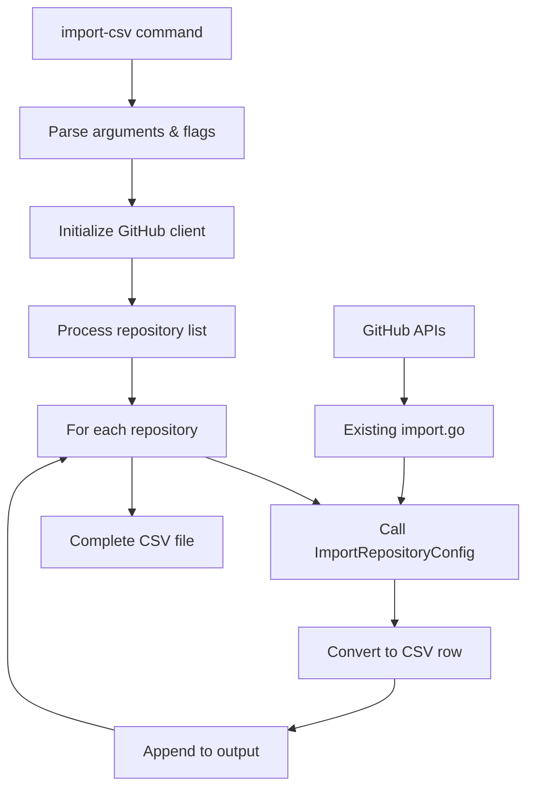

# CSV Import Feature Specification

## Overview

Add a new `import-csv` subcommand to ownershit that enables bulk repository configuration analysis by importing settings from multiple GitHub repositories and outputting them in CSV format for mass configuration management.

## Background

The existing [`import`](cmd/ownershit/main.go:128) command extracts repository configuration from a single repository and outputs YAML. This new feature extends that capability to support mass import across many repositories, focusing on shared organizational settings rather than repository-specific configurations.

## Goals

- Enable bulk repository configuration analysis across organizations
- Support building configuration inventories for compliance and standardization
- Provide CSV output suitable for spreadsheet analysis and reporting
- Maintain consistency with existing import functionality
- Focus on organizationally-relevant shared settings

## Non-Goals

- Repository-specific data like custom labels (too variable for mass analysis)
- Full YAML export capabilities (existing `import` command handles this)
- Real-time synchronization or monitoring

## Design

### Command Interface

**New Subcommand**: `import-csv`

```bash
ownershit import-csv [flags] owner1/repo1 [owner2/repo2] ...
```

**Flags**:

- `--output` / `-o`: Output CSV file path (default: stdout)
- `--append` / `-a`: Append to existing CSV file instead of overwriting
- `--debug` / `-d`: Enable debug logging (inherits from existing pattern)
- `--batch-file` / `-f`: Read repository list from file (one `owner/repo` per line)

**Examples**:

```bash
# Single repository to stdout
ownershit import-csv myorg/repo1

# Multiple repositories to file
ownershit import-csv -o settings.csv myorg/repo1 myorg/repo2 otherorg/repo3

# Append to existing CSV (useful for incremental building)
ownershit import-csv --append -o settings.csv myorg/new-repo

# Batch import from file
ownershit import-csv -f repositories.txt -o all-settings.csv
```

### CSV Schema

**27 columns** capturing shared repository configuration:

```csv
owner,repo,organization,wiki_enabled,issues_enabled,projects_enabled,private,archived,template,default_branch,delete_branch_on_merge,discussions_enabled,require_pull_request_reviews,require_approving_count,require_code_owners,allow_merge_commit,allow_squash_merge,allow_rebase_merge,require_status_checks,require_up_to_date_branch,enforce_admins,restrict_pushes,require_conversation_resolution,require_linear_history,allow_force_pushes,allow_deletions,status_checks,push_allowlist
```

**Data Types**:

- Booleans: `true`/`false` strings
- Numbers: Integer strings
- Arrays: Pipe-separated values (`item1|item2|item3`)
- Nulls: Empty strings

**Included Settings** (shared/organizational):

- Repository metadata: wiki, issues, projects, private, archived, template
- Branch protection: PR reviews, status checks, admin enforcement, restrictions
- Merge strategies: merge commit, squash, rebase policies
- Advanced protection: conversation resolution, linear history, force pushes
- Security settings: push restrictions, allowlists

**Excluded Settings** (repository-specific):

- Default labels (highly customized per repository)
- Repository descriptions/homepages (not useful for mass analysis)
- Individual team assignments (captured separately)

## Implementation

### Architecture



### File Structure

**New Files**:

1. `csv_import.go` - Core CSV import functionality
2. `csv_import_test.go` - Comprehensive test coverage

**Modified Files**:

1. [`cmd/ownershit/main.go`](cmd/ownershit/main.go) - Add CLI command definition

### Key Functions

```go
// csv_import.go
func ImportRepositoryConfigToCSV(repos []string, output io.Writer, client *GitHubClient) error
func convertToCSVRow(config *PermissionsSettings, owner, repo string) []string
func writeCSVHeader(writer *csv.Writer) error
func parseRepositoryList(args []string, batchFile string) ([]string, error)

// cmd/ownershit/main.go
func importCSVCommand(c *cli.Context) error
```

### Integration Points

**Reuse Existing Components**:

- [`ImportRepositoryConfig()`](import.go:14) - Core import logic
- [`configureImportClient()`](cmd/ownershit/main.go:209) - GitHub client setup
- [`GitHubClient`](import.go:14) - API integration
- [`PermissionsSettings`](config.go:56), [`Repository`](config.go:65), [`BranchPermissions`](config.go:35) - Data structures
- Error types: [`GitHubAPIError`](import.go:95), logging patterns

**CLI Integration**:

- Add to [`cli.App.Commands`](cmd/ownershit/main.go:34) array
- Follow existing flag patterns (`--debug`, `--output`)
- Use [`urfave/cli/v2`](cmd/ownershit/main.go:13) framework consistently

## Error Handling

### Input Validation

- Validate `owner/repo` format early, reject malformed inputs
- Check batch file existence and readability
- Verify output file write permissions before processing
- Validate CSV header compatibility in append mode

### GitHub API Resilience

- Handle rate limiting with exponential backoff
- Respect `X-RateLimit-*` headers
- Continue processing on individual repository failures (403/404)
- Log failures but don't abort entire operation
- Retry transient network failures
- Fail fast on authentication errors

### Data Integrity

- Escape CSV special characters in repository data
- Use atomic writes (temporary files) to prevent corruption
- Handle disk space and permission errors gracefully
- Provide progress logging for long-running operations

## Acceptance Criteria

### Core Functionality

- [ ] `import-csv` subcommand accepts multiple `owner/repo` arguments
- [ ] CSV output includes all 27 designed columns with correct data
- [ ] Command reuses existing [`ImportRepositoryConfig()`](import.go:14) for consistency
- [ ] Valid CSV format parseable by standard libraries
- [ ] Default output to stdout, file output with `--output` flag
- [ ] `--append` flag adds to existing CSV without header duplication

### CLI Integration

- [ ] Integrates with [`urfave/cli/v2`](cmd/ownershit/main.go:13) framework
- [ ] Follows patterns from [`cmd/ownershit/main.go`](cmd/ownershit/main.go)
- [ ] `--debug` flag enables detailed logging
- [ ] `--batch-file` reads repository list from file
- [ ] Error handling matches existing command patterns

### Data Accuracy

- [ ] Repository fields match [`Repository`](config.go:65) struct values
- [ ] Branch protection matches [`BranchPermissions`](config.go:35) struct values
- [ ] Boolean values output as `true`/`false` strings
- [ ] Arrays output as pipe-separated values
- [ ] Missing/null values handled as empty strings

### Performance & Reliability

- [ ] Handles GitHub API rate limits gracefully
- [ ] Processes large repository lists efficiently
- [ ] Continues on individual repository failures
- [ ] Progress logging for batch operations
- [ ] Memory-efficient streaming for large outputs

## Testing Strategy

### Unit Tests (`csv_import_test.go`)

- CSV conversion logic with mock [`PermissionsSettings`](config.go:56) data
- Header generation and row formatting
- Error handling for malformed inputs
- Append mode validation

### Integration Tests

- End-to-end CLI command execution
- GitHub API integration with test repositories
- File I/O operations (create, append, error cases)
- Batch file processing

### Performance Tests

- Large repository list processing
- Memory usage validation
- Rate limiting behavior

## Implementation Phases

### Phase 1: Core Functionality

- Basic CSV export for multiple repositories
- CLI command integration
- Core error handling

### Phase 2: Advanced Features

- Batch file support (`--batch-file`)
- Append mode (`--append`)
- Enhanced progress tracking

### Phase 3: Performance & Polish

- Rate limiting optimizations
- Memory efficiency improvements
- Comprehensive error recovery

## Example Output

```csv
owner,repo,organization,wiki_enabled,issues_enabled,projects_enabled,private,archived,template,default_branch,delete_branch_on_merge,discussions_enabled,require_pull_request_reviews,require_approving_count,require_code_owners,allow_merge_commit,allow_squash_merge,allow_rebase_merge,require_status_checks,require_up_to_date_branch,enforce_admins,restrict_pushes,require_conversation_resolution,require_linear_history,allow_force_pushes,allow_deletions,status_checks,push_allowlist
myorg,web-app,myorg,true,true,true,false,false,false,main,true,true,true,2,true,false,true,true,true,true,true,true,true,true,false,false,ci/build|ci/test|security/scan,admin-team|deploy-team
myorg,api-service,myorg,true,true,false,false,false,false,main,true,false,true,1,false,true,true,false,false,false,false,false,false,false,false,false,,
otherorg,mobile-app,otherorg,false,true,true,true,false,false,develop,false,false,false,0,false,true,false,true,false,false,false,false,false,false,false,false,,
```

## Documentation Updates

- Update README.md with new command example
- Add to CLI help text and usage examples
- Include in existing documentation about import functionality

## Security Considerations

- Reuse existing GitHub token validation
- No additional authentication requirements
- Same permissions as existing `import` command
- CSV output contains no sensitive data (public repository settings only)

---

**Next Steps**: Implement Phase 1 core functionality with basic CSV export and CLI integration.
